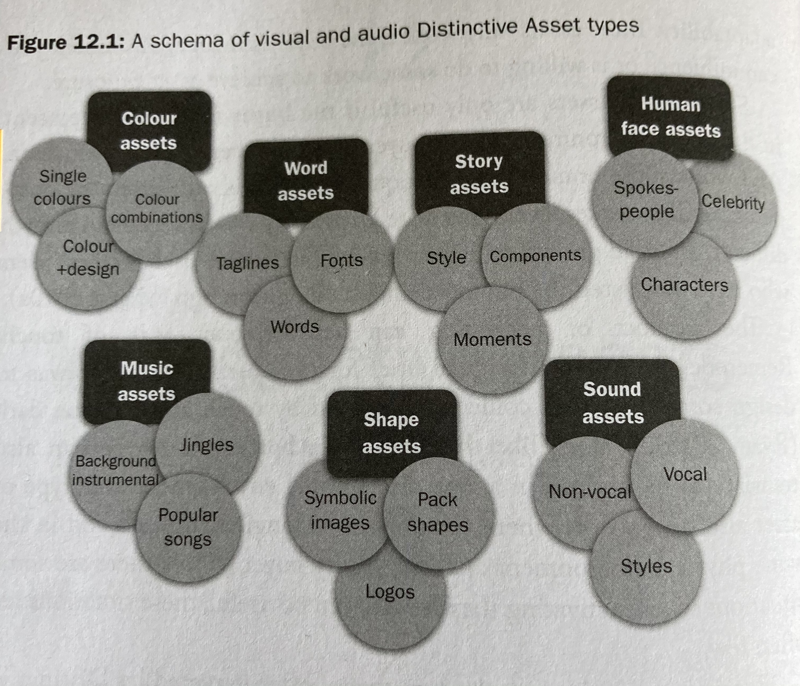
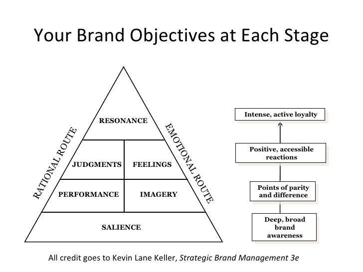

What is a Brand ?
===

Managing and marketing a premium brand demands that we think through every facet of the brand experience. 

BRAND DATABASE: [https://www.tmdn.org/tmview](https://www.tmdn.org/tmview)

Brand Consistency — Timeless Marketing

Apple and Google, Coca Cola, Microsoft and Toyota. Tesla and Dior

**Brand** is the perception of the company in the eyes of the world.

refers to the perceived image and subsequent emotional response to a company, its products and services.

the conversation that customers are having with each other about the company, and how that spreads.

A brand is the set of expectations, memories, stories and relationships that, taken together, account for a consumer’s decision to choose one product or service over another. If the consumer (whether it’s a business, a buyer, a voter or a donor) doesn’t pay a premium, make a selection or spread the word, then no brand value exists for that consumer.

**Branding** involves the marketing practice of actively shaping a distinctive brand.

**Brand identity** is the collection of all brand elements that the company creates to portray the right image of itself to the consumer.

describes the visual devices used to represent the company

visual components package that is paired with style guidelines and used as a framework to ensure the corporate image is cohesive and consistent.

Some of the visual devices that leverage the brand elements and style guidelines are as follows: [stationery](http://designspiration.net/tag/stationary/?utm_source=CMblog&utm_medium=link&utm_campaign=Designing+a+Brand+Identity), [marketing collateral](http://designspiration.net/tag/marketing/?utm_source=CMblog&utm_medium=link&utm_campaign=Designing+a+Brand+Identity), [packaging](http://designspiration.net/tag/packaging/?utm_source=CMblog&utm_medium=link&utm_campaign=Designing+a+Brand+Identity), [signage](http://designspiration.net/tag/signage/?utm_source=CMblog&utm_medium=link&utm_campaign=Designing+a+Brand+Identity), messaging, and [digital projects](http://designspiration.net/tag/web%20design/), among others.

Those tangible elements—the shoes, the haircut, the team membership—that’s brand identity. Your brand identity is what makes you instantly recognizable to your customers. Your audience will associate your brand identity with your product or service, and that identity is what forges the connection between you and your customers, builds customer loyalty, and determines how your customers will perceive your brand.

A BRAND SERVE FOR LOYALTY

- Branding is all about consistency -- consistency in the colors you use, the words you say and, most importantly, the experience users have with your product.
- Authenticity means; acting in a way that we expect you to act, being consistent, even when we’re not looking. And that’s when brands fall apart, when we discover that behind the scenes you’re not who we thought you were.
- But if we’re consistent in being who people think we are, then we’re seen as authentic. When we’re seen as authentic the promise of the brand becomes more valuable.”