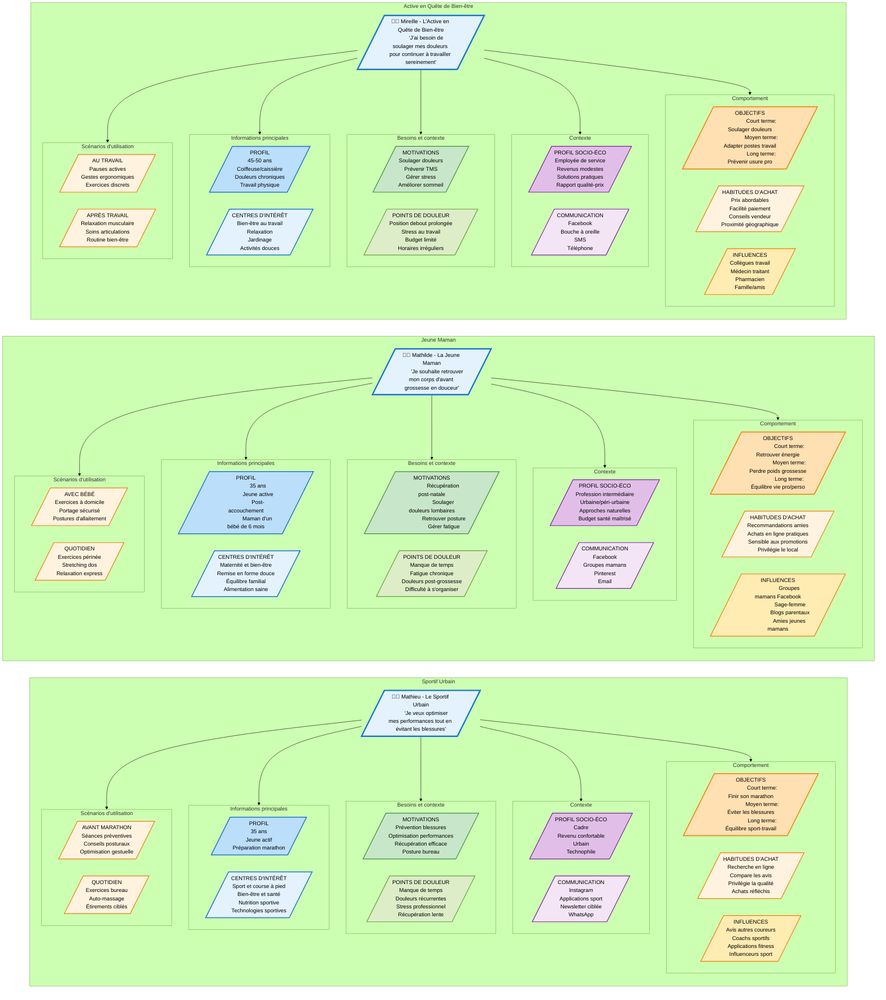

```mermaid
%%{
    init: {
        'theme': 'forest',
        'flowchart': {
            'curve': 'basis'
        }
    }
}%%
flowchart RL
    %% Styles personnalisés avec nouvelle palette de couleurs et hiérarchie visuelle améliorée
    classDef persona fill:#e3f2fd,stroke:#1976d2,stroke-width:4px,rx:15
    
    %% Informations principales - Tons de bleu
    classDef profile fill:#bbdefb,stroke:#1976d2,stroke-width:2.5px,rx:10
    classDef interests fill:#e3f2fd,stroke:#1976d2,stroke-width:2.5px,rx:10
    
    %% Besoins et contexte - Tons de vert
    classDef motivations fill:#c8e6c9,stroke:#388e3c,stroke-width:2px,rx:12
    classDef painpoints fill:#dcedc8,stroke:#689f38,stroke-width:2px,rx:12
    
    %% Contexte - Tons de violet
    classDef socioeco fill:#e1bee7,stroke:#7b1fa2,stroke-width:2px,rx:12
    classDef communication fill:#f3e5f5,stroke:#7b1fa2,stroke-width:2px,rx:12
    
    %% Comportement - Tons de orange/pêche
    classDef objectives fill:#ffe0b2,stroke:#f57c00,stroke-width:2.5px,rx:10
    classDef habits fill:#fff3e0,stroke:#f57c00,stroke-width:2px,rx:10
    classDef influences fill:#ffecb3,stroke:#f57c00,stroke-width:2px,rx:10

    %% Mathieu
    subgraph Persona1["Sportif Urbain"]
        Mathieu[/"🧑‍💼 Mathieu - Le Sportif Urbain
        'Je veux optimiser mes performances tout en évitant les blessures'"/]:::persona
        
        subgraph MathieuInfo["Informations principales"]
            MathieuProfile[/"
                PROFIL
                35 ans
                Jeune actif
                Préparation marathon
            "/]:::profile
            MathieuInterets[/"
                CENTRES D'INTÉRÊT
                Sport et course à pied
                Bien-être et santé
                Nutrition sportive
                Technologies sportives
            "/]:::interests
        end

        subgraph MathieuNeeds["Besoins et contexte"]
            MathieuMotiv[/"
                MOTIVATIONS
                Prévention blessures
                Optimisation performances
                Récupération efficace
                Posture bureau
            "/]:::motivations
            MathieuPain[/"
                POINTS DE DOULEUR
                Manque de temps
                Douleurs récurrentes
                Stress professionnel
                Récupération lente
            "/]:::painpoints
        end

        subgraph MathieuContext["Contexte"]
            MathieuCSP[/"
                PROFIL SOCIO-ÉCO
                Cadre
                Revenu confortable
                Urbain
                Technophile
            "/]:::socioeco
            MathieuComm[/"
                COMMUNICATION
                Instagram
                Applications sport
                Newsletter ciblée
                WhatsApp
            "/]:::communication
        end

        subgraph MathieuBehavior["Comportement"]
            MathieuObj[/"
                OBJECTIFS
                Court terme: Finir son marathon
                Moyen terme: Éviter les blessures
                Long terme: Équilibre sport-travail
            "/]:::objectives
            MathieuHabits[/"
                HABITUDES D'ACHAT
                Recherche en ligne
                Compare les avis
                Privilégie la qualité
                Achats réfléchis
            "/]:::habits
            MathieuInflu[/"
                INFLUENCES
                Avis autres coureurs
                Coachs sportifs
                Applications fitness
                Influenceurs sport
            "/]:::influences
        end

        subgraph MathieuScenarios["Scénarios d'utilisation"]
            MathieuUse1[/"
                AVANT MARATHON
                Séances préventives
                Conseils posturaux
                Optimisation gestuelle
            "/]:::habits
            MathieuUse2[/"
                QUOTIDIEN
                Exercices bureau
                Auto-massage
                Étirements ciblés
            "/]:::habits
        end
    end

    %% Relations Mathieu
    Mathieu --> MathieuInfo
    Mathieu --> MathieuNeeds
    Mathieu --> MathieuContext
    Mathieu --> MathieuBehavior
    Mathieu --> MathieuScenarios

    %% Mathilde
    subgraph Persona2["Jeune Maman"]
        Mathilde[/"👩‍👦 Mathilde - La Jeune Maman
        'Je souhaite retrouver mon corps d'avant grossesse en douceur'"/]:::persona
        
        subgraph MathildeInfo["Informations principales"]
            MathildeProfile[/"
                PROFIL
                35 ans
                Jeune active
                Post-accouchement
                Maman d'un bébé de 6 mois
            "/]:::profile
            MathildeInterets[/"
                CENTRES D'INTÉRÊT
                Maternité et bien-être
                Remise en forme douce
                Équilibre familial
                Alimentation saine
            "/]:::interests
        end

        subgraph MathildeNeeds["Besoins et contexte"]
            MathildeMotiv[/"
                MOTIVATIONS
                Récupération post-natale
                Soulager douleurs lombaires
                Retrouver posture
                Gérer fatigue
            "/]:::motivations
            MathildePain[/"
                POINTS DE DOULEUR
                Manque de temps
                Fatigue chronique
                Douleurs post-grossesse
                Difficulté à s'organiser
            "/]:::painpoints
        end

        subgraph MathildeContext["Contexte"]
            MathildeCSP[/"
                PROFIL SOCIO-ÉCO
                Profession intermédiaire
                Urbaine/péri-urbaine
                Approches naturelles
                Budget santé maîtrisé
            "/]:::socioeco
            MathildeComm[/"
                COMMUNICATION
                Facebook
                Groupes mamans
                Pinterest
                Email
            "/]:::communication
        end

        subgraph MathildeBehavior["Comportement"]
            MathildeObj[/"
                OBJECTIFS
                Court terme: Retrouver énergie
                Moyen terme: Perdre poids grossesse
                Long terme: Équilibre vie pro/perso
            "/]:::objectives
            MathildeHabits[/"
                HABITUDES D'ACHAT
                Recommandations amies
                Achats en ligne pratiques
                Sensible aux promotions
                Privilégie le local
            "/]:::habits
            MathildeInflu[/"
                INFLUENCES
                Groupes mamans Facebook
                Sage-femme
                Blogs parentaux
                Amies jeunes mamans
            "/]:::influences
        end

        subgraph MathildeScenarios["Scénarios d'utilisation"]
            MathildeUse1[/"
                AVEC BÉBÉ
                Exercices à domicile
                Portage sécurisé
                Postures d'allaitement
            "/]:::habits
            MathildeUse2[/"
                QUOTIDIEN
                Exercices périnée
                Stretching dos
                Relaxation express
            "/]:::habits
        end
    end

    %% Relations Mathilde
    Mathilde --> MathildeInfo
    Mathilde --> MathildeNeeds
    Mathilde --> MathildeContext
    Mathilde --> MathildeBehavior
    Mathilde --> MathildeScenarios

    %% Mireille
    subgraph Persona3["Active en Quête de Bien-être"]
        Mireille[/"👩‍💼 Mireille - L'Active en Quête de Bien-être
        'J'ai besoin de soulager mes douleurs pour continuer à travailler sereinement'"/]:::persona
        
        subgraph MireilleInfo["Informations principales"]
            MireilleProfile[/"
                PROFIL
                45-50 ans
                Coiffeuse/caissière
                Douleurs chroniques
                Travail physique
            "/]:::profile
            MireilleInterets[/"
                CENTRES D'INTÉRÊT
                Bien-être au travail
                Relaxation
                Jardinage
                Activités douces
            "/]:::interests
        end

        subgraph MireilleNeeds["Besoins et contexte"]
            MireilleMotiv[/"
                MOTIVATIONS
                Soulager douleurs
                Prévenir TMS
                Gérer stress
                Améliorer sommeil
            "/]:::motivations
            MireillePain[/"
                POINTS DE DOULEUR
                Position debout prolongée
                Stress au travail
                Budget limité
                Horaires irréguliers
            "/]:::painpoints
        end

        subgraph MireilleContext["Contexte"]
            MireilleCSP[/"
                PROFIL SOCIO-ÉCO
                Employée de service
                Revenus modestes
                Solutions pratiques
                Rapport qualité-prix
            "/]:::socioeco
            MireilleComm[/"
                COMMUNICATION
                Facebook
                Bouche à oreille
                SMS
                Téléphone
            "/]:::communication
        end

        subgraph MireilleBehavior["Comportement"]
            MireilleObj[/"
                OBJECTIFS
                Court terme: Soulager douleurs
                Moyen terme: Adapter postes travail
                Long terme: Prévenir usure pro
            "/]:::objectives
            MireilleHabits[/"
                HABITUDES D'ACHAT
                Prix abordables
                Facilité paiement
                Conseils vendeur
                Proximité géographique
            "/]:::habits
            MireilleInflu[/"
                INFLUENCES
                Collègues travail
                Médecin traitant
                Pharmacien
                Famille/amis
            "/]:::influences
        end

        subgraph MireilleScenarios["Scénarios d'utilisation"]
            MireilleUse1[/"
                AU TRAVAIL
                Pauses actives
                Gestes ergonomiques
                Exercices discrets
            "/]:::habits
            MireilleUse2[/"
                APRÈS TRAVAIL
                Relaxation musculaire
                Soins articulations
                Routine bien-être
            "/]:::habits
        end
    end

    %% Relations Mireille
    Mireille --> MireilleInfo
    Mireille --> MireilleNeeds
    Mireille --> MireilleContext
    Mireille --> MireilleBehavior
    Mireille --> MireilleScenarios
```