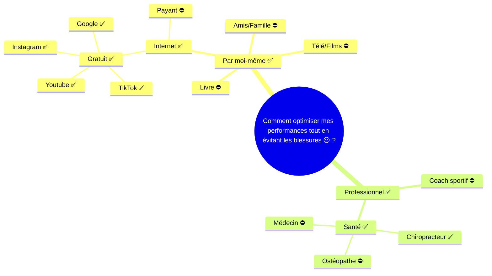

# Sportif Urbain
Je veux optimiser mes performances tout en évitant les blessures

## Demographics
- 25-35 years old
- Male / Female
- Living in Paris
- Sporty
- Job: Jeune actif / Cadre
- Income: Revenus comfortable 

## Interests
- Sport et course à pied
- Bien-être et santé
- Nutrition sportive
- Technologies sportives

## Prefered channels
- Instagram
- Google
- Youtube
- Targeted E-mail
- Applications sport
- WhatsApp

## Background Context
Life story and experiences
Préparation marathon

## Gains Points & Beliefs // Practical Needs
Prévention blessures
Optimisation performances
Récupération efficace
Posture bureau

## Pain Points
Manque de temps
Douleurs récurrentes
Stress professionnel
Récupération lente

## Challenging Jobs & Behaviors & Frustrations
- 

## Scénarios d'utilisation
**Avant un marathon**
Séance préventives
Conseils posturaux
Optimisation gestuelle

**Quotidien**
Exercices bureau
Auto-massage
Étirement ciblés

## Search Intent
Le searcher habite à côté
Le searcher travail à côté
Le searcher a été influencé par une réference ou instagram

### Goals
Short term: Finir son marathon
Middle term: éviter les blessures
Long term: Équilibre sport-travail

### Habitudes d'achat
Recherche en ligne
Compare les avis
Privilégie la qualité
Achats réfléchis

### Influences
Avis d'autres coureurs
Coaches sportifs
Applications fitness
Influenceurs sportifs

## Parcours client

## Proposition de valeur

### Gains Creators

### Pain Relievers

### Products & Services