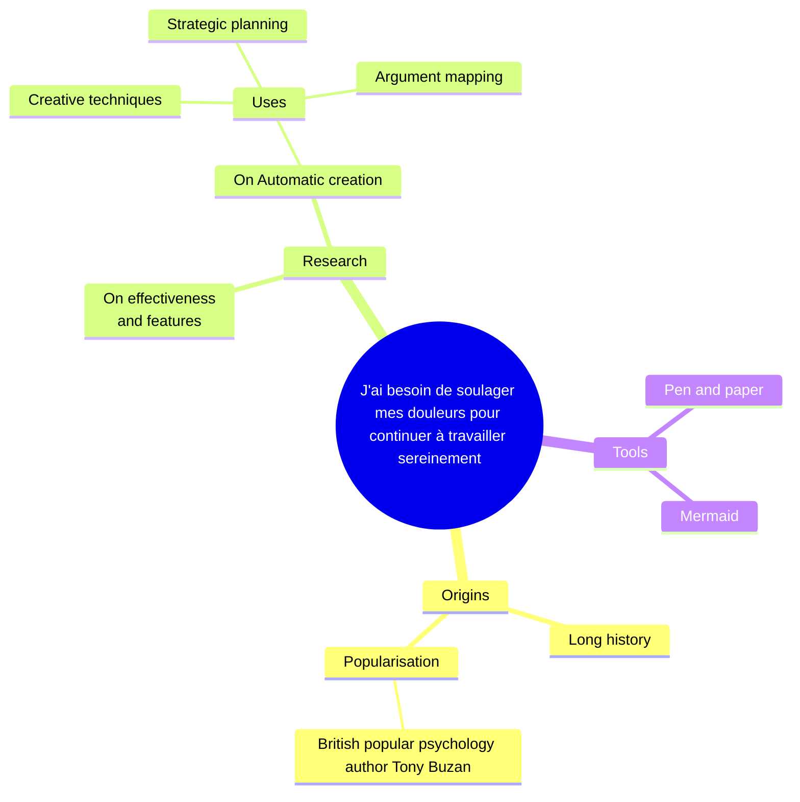

# Actif(ve) en Quête de bien-être
J'ai besoin de soulager mes douleurs pour continuer à travailler sereinement

## Demographics
- 45-65 years old
- Male / Female
- Living in Paris / Urbaine / péri-urbaine
- Active
- Job: Retraité / Profession intermédiaire / Coiffeuse / Caissière
- Income: Revenus modestes
- douleurs chroniques
- Travail physique
- Employée de service
- Solutions pratiques
- Rapport qualité/prix

## Prefered channels
- Facebook
- Bouche à oreille
- SMS
- Téléphone	

## Interests
- Bien-être au travail
- Relaxation
- Jardinage
- Activités douces

## Motivations
- Soulager douleurs
- Prévenir TMS
- Gérer stress
- Améliorer sommeil

## Point de douleur
- Position debout prolongée
- Stress au travail
- Budget limité
- Horaires irréguliers

## Scénarios d'utilisation
AU TRAVAIL
- Pauses actives
- Gestes ergonomiques
- Exercices discrets

APRÈS LE TRAVAIL
- Relaxation musculaire
- Soins articulations
- Routine bien-être

## Goals
Short term: Soulager douleurs
Middle term: Adapter postes travail
Long term: Prévenir usure pro

## Habitudes d'achat
- Prix abordable
- Facilité paiement
- Conseils vendeur
- Proximité géographique

## Influences
- Collègues travail
- Médecin traitant
- Pharmacien
- Famille / Amis 

## Gains Creators

## Pain Relievers

## Products & Services