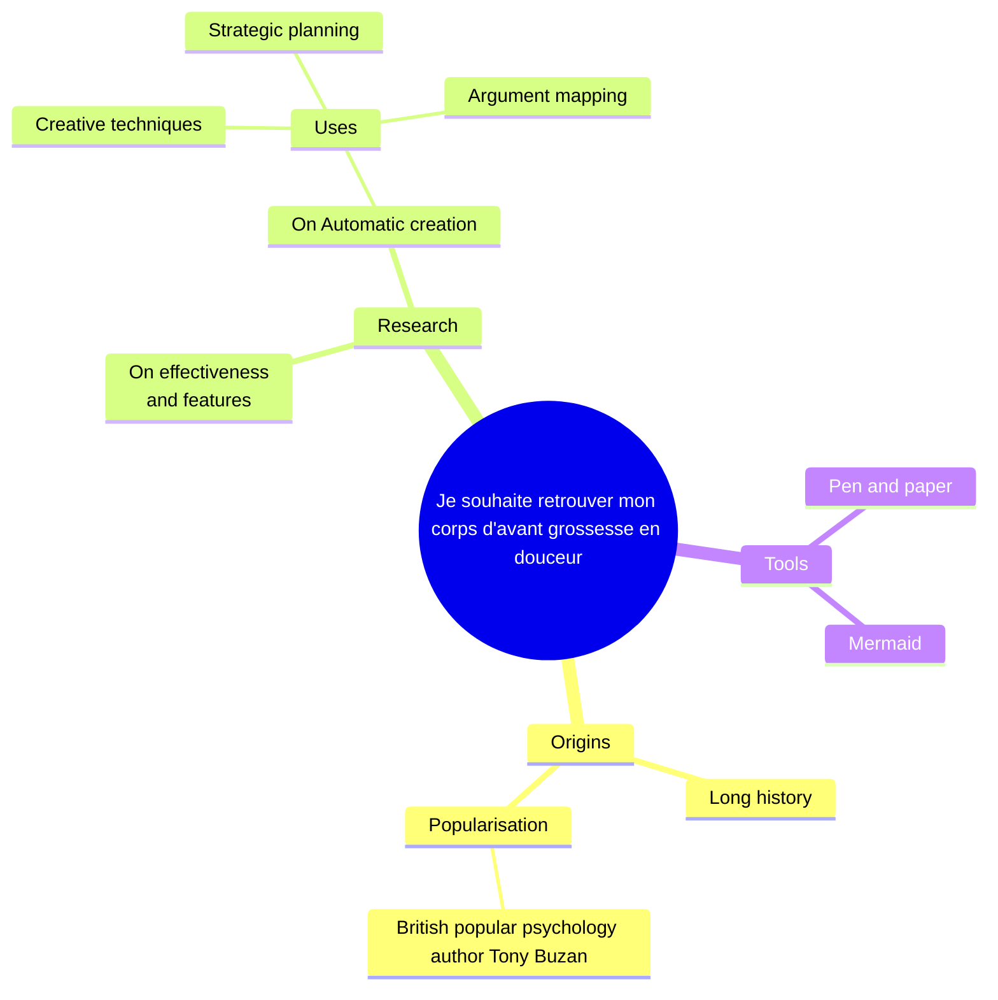

# Femme enceinte
Je souhaite retrouver mon corps d'avant grossesse en douceur

## Demographics
- 25-35 years old
- Female
- Living in Paris / Urbaine / péri-urbaine
- Pregnant / Post accouchement / Maman d'un bébé de 6 mois
- Job: Profession intermédiaire
- Income: Budget santé maitrisé

## Motivations
- Récupération post-natale
- Soulager douleurs lombaires
- Retrouver posture
- Gérer fatigue

## Points de douleur
- Manque de temps
- Fatigue chronique
- Douleurs post-grossesse
- Difficulté à s'organiser

## Interests
- Maternité et bien-être
- Remise en forme douce
- Équilibre famillial
- Alimentation saine
  
## Prefered channels
- Facebook
- Groupes mamans
- Pinterest
- Email

## Scénarios d'utilisation
AVEC BÉBÉ
- Exercices à domicile
- Portage sécurisé
- Posture d'allaitement

QUOTIDIEN
- Exercice périnée
- Stretching dos
- Relaxation express

## Goals
Short term: Retrouver énergie
Middle term: Perdre poids grossesse
Long term: Équilibre vie pro/perso

## Habitudes d'achat
- Recommandation amies
- Achats en ligne pratiques
- Sensible aux promotions
- Privilégie le local

## Influences
- Groupes mamans Facebook
- Sage-femme
- Blogs parentaux
- Amies jeunes mamans

## Gains Creators

## Pain Relievers

## Products & Services