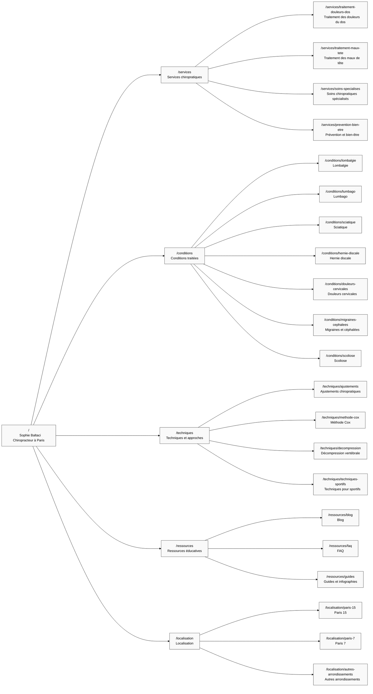

```mermaid
%%{
    init: {
        'theme': 'forest',
        'flowchart': {
            'nodeSpacing': 70, 
            'rankSpacing': 500, 
            'width': 500
        }
    }
}%%
flowchart LR
    %% Styles
    classDef node fill:#f9f9f9,stroke:#333

    %% Master topic - Sophie Baltaci Chiropracteur à Paris - À Propos et Contact
    accueil["/
    Sophie Baltaci Chiropracteur à Paris"]:::node
    
    services["/services
    Services chiropratiques"]:::node
    
    conditions["/conditions
    Conditions traitées"]:::node
    
    techniques["/techniques
    Techniques et approches"]:::node
    
    ressources["/ressources
    Ressources éducatives"]:::node
    
    localisation["/localisation
    Localisation"]:::node

    %% Navigation principale
    accueil --> services
    accueil --> conditions
    accueil --> techniques
    accueil --> ressources
    accueil --> localisation

    %% Sous-pages Services
    services --> douleurs-dos["/services/traitement-douleurs-dos
    Traitement des douleurs du dos"]:::node
    services --> maux-tete["/services/traitement-maux-tete
    Traitement des maux de tête"]:::node
    services --> soins-specialises["/services/soins-specialises
    Soins chiropratiques spécialisés"]:::node
    services --> prevention["/services/prevention-bien-etre
    Prévention et bien-être"]:::node

    %% Sous-pages Conditions
    conditions --> lombalgie["/conditions/lombalgie
    Lombalgie"]:::node
    conditions --> lumbago["/conditions/lumbago
    Lumbago"]:::node
    conditions --> sciatique["/conditions/sciatique
    Sciatique"]:::node
    conditions --> hernie["/conditions/hernie-discale
    Hernie discale"]:::node
    conditions --> cervicales["/conditions/douleurs-cervicales
    Douleurs cervicales"]:::node
    conditions --> migraines["/conditions/migraines-cephalees
    Migraines et céphalées"]:::node
    conditions --> scoliose["/conditions/scoliose
    Scoliose"]:::node

    %% Sous-pages Techniques
    techniques --> ajustements["/techniques/ajustements
    Ajustements chiropratiques"]:::node
    techniques --> cox["/techniques/methode-cox
    Méthode Cox"]:::node
    techniques --> decompression["/techniques/decompression
    Décompression vertébrale"]:::node
    techniques --> sportifs["/techniques/techniques-sportifs
    Techniques pour sportifs"]:::node

    %% Sous-pages Ressources
    ressources --> blog["/ressources/blog
    Blog"]:::node
    ressources --> faq["/ressources/faq
    FAQ"]:::node
    ressources --> guides["/ressources/guides
    Guides et infographies"]:::node

    %% Sous-pages Localisation
    localisation --> paris15["/localisation/paris-15
    Paris 15"]:::node
    localisation --> paris7["/localisation/paris-7
    Paris 7"]:::node
    localisation --> autres["/localisation/autres-arrondissements
    Autres arrondissements"]:::node
```