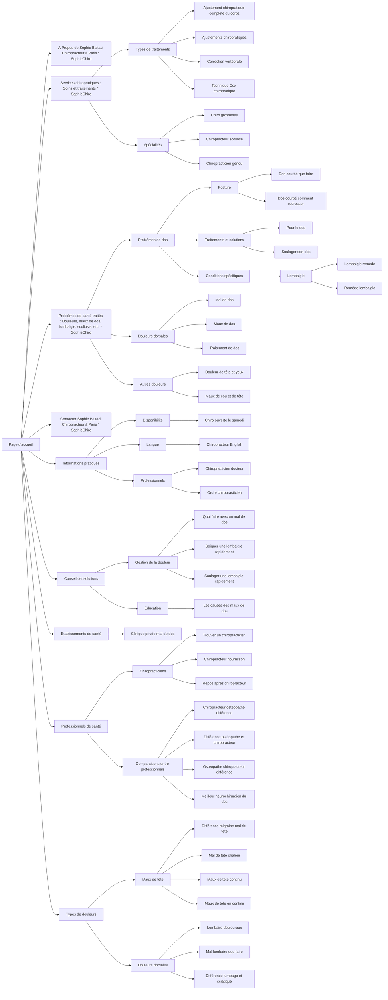

```mermaid
flowchart LR

    accueil[Page d'accueil]

    accueil --> apropos[À Propos de Sophie Baltaci Chiropracteur à Paris * SophieChiro]
    accueil --> services[Services chiropratiques : Soins et traitements * SophieChiro]
    accueil --> problemes[Problèmes de santé traités : Douleurs, maux de dos, lombalgie, scoliosis, etc. * SophieChiro]
    accueil --> contact[Contacter Sophie Baltaci Chiropracteur à Paris * SophieChiro]

    accueil --> infos[Informations pratiques] 
    accueil --> conseils[Conseils et solutions]
    accueil --> etab[Établissements de santé]
    accueil --> pros[Professionnels de santé]
    accueil --> douleurs[Types de douleurs]

    %% Services branch
    services --> traitements[Types de traitements]
    traitements --> ajustement[Ajustement chiropratique complète du corps]
    traitements --> ajustements[Ajustements chiropratiques]
    traitements --> correction[Correction vertébrale]
    traitements --> cox[Technique Cox chiropratique]
    
    services --> specialites[Spécialités]
    specialites --> grossesse[Chiro grossesse]
    specialites --> scoliose[Chiropracteur scoliose]
    specialites --> genou[Chiropracticien genou]

    %% Problèmes branch
    problemes --> dos[Problèmes de dos]
    dos --> posture[Posture]
    posture --> doscourbe[Dos courbé que faire]
    posture --> redresser[Dos courbé comment redresser]
    
    dos --> traitementsSolutions[Traitements et solutions]
    traitementsSolutions --> pourdos[Pour le dos]
    traitementsSolutions --> soulagerDos[Soulager son dos]
    
    dos --> specifiques[Conditions spécifiques]
    specifiques --> lombalgie[Lombalgie]
    lombalgie --> lombalgieRemede[Lombalgie remède]
    lombalgie --> remedeLombalgie[Remède lombalgie]

    problemes --> dorsales[Douleurs dorsales]
    dorsales --> maldos[Mal de dos]
    dorsales --> mauxdos[Maux de dos]
    dorsales --> traitementdos[Traitement de dos]

    problemes --> autresdouleurs[Autres douleurs]
    autresdouleurs --> tete[Douleur de tête et yeux]
    autresdouleurs --> cou[Maux de cou et de tête]

    %% Informations pratiques branch
    infos --> disponibilite[Disponibilité]
    disponibilite --> samedi[Chiro ouverte le samedi]
    
    infos --> langue[Langue]
    langue --> english[Chiropracteur English]

    infos --> professionnels[Professionnels]
    professionnels --> docteur[Chiropracticien docteur]
    professionnels --> ordre[Ordre chiropracticien]

    %% Conseils branch
    conseils --> gestiondouleur[Gestion de la douleur]
    gestiondouleur --> quoifaire[Quoi faire avec un mal de dos]
    gestiondouleur --> soigner[Soigner une lombalgie rapidement]
    gestiondouleur --> soulager[Soulager une lombalgie rapidement]

    conseils --> education[Éducation]
    education --> causes[Les causes des maux de dos]

    %% Établissements branch
    etab --> clinique[Clinique privée mal de dos]

    %% Professionnels branch
    pros --> chiros[Chiropracticiens]
    chiros --> trouver[Trouver un chiropracticien]
    chiros --> nourrisson[Chiropracteur nourrisson]
    chiros --> repos[Repos après chiropracteur]

    pros --> comparaisons[Comparaisons entre professionnels]
    comparaisons --> difference1[Chiropracteur ostéopathe différence]
    comparaisons --> difference2[Différence ostéopathe et chiropracteur]
    comparaisons --> difference3[Ostéopathe chiropracteur différence]
    comparaisons --> neurochirurgien[Meilleur neurochirurgien du dos]

    %% Types de douleurs branch
    douleurs --> mauxtete[Maux de tête]
    mauxtete --> differencemigraine[Différence migraine mal de tete]
    mauxtete --> chaleur[Mal de tete chaleur]
    mauxtete --> continu[Maux de tete continu]
    mauxtete --> enContinu[Maux de tete en continu]

    douleurs --> douleursDorsales[Douleurs dorsales]
    douleursDorsales --> lombaire[Lombaire douloureux]
    douleursDorsales --> malLombaire[Mal lombaire que faire]
    douleursDorsales --> differenceLombaire[Différence lumbago et sciatique]
```
